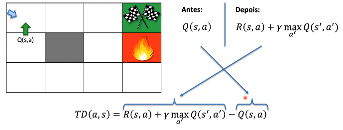
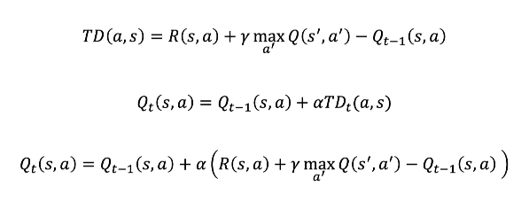

# Diferença Temporal (coração e alma do Q-Learning)

**TD** é a diferença temporal fazendo uma ação para o estado **s** é igual
a o valor novo que foi calculado depois subtraindo do valor anterior,
em outras palavras você faz uma atualização dos valores de **Q** a medida
que o agente vai interagindo com o ambiente.

O nome **diferença temporal** vem porque você está calculando o mesmo valor mas
em tempos diferentes, você já tinha o valor de **Q** anterior e quando o agente
voltar naquele mesmo ponto no mapa ele vai fazer a atualização desse valor do
Q. Quando trabalhamos com esse tipo de aprendizagem de maquina o objetivo é 
encontrar os valores de Q, assim como em uma rede neural artificial o objetivo
é encontrar os valores dos pesos em um ambiente de aprendizado por reforço utilizando
esse algoritmo o objetivo é encontrar os melhores valores de Q. 

observação: no ambiente os eventos *randomicos* podem somente acontecer as vezes.

O objetivo desse algoritmo é que essa diferença temporal seja a menor possível 
que indica valores de ações mais consistentes para os agentes. 

3 formas de escrever a fórmula, o alfa é a taxa de aprendizagem:

# Leitura

[Learning to Predict by the Methods of Temporal Differences - Richard Sutton (1988)](https://link.springer.com/article/10.1007/BF00115009)