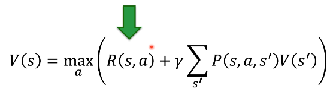
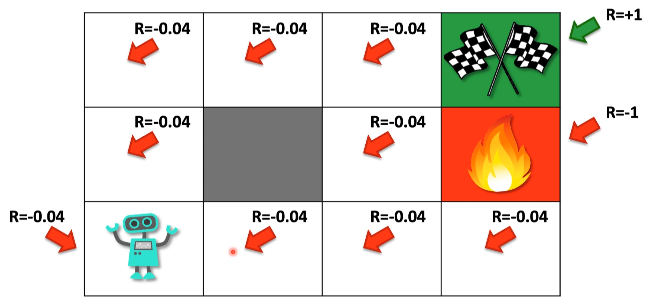
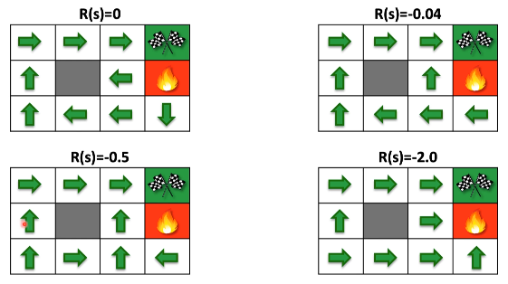

# Adição de Penalidades - "Living Penalty"

A parte da equação de bellman que foca na recompensa e penalidade é essa:

Em problemas complexo temos a punição e recompensa dada a cada uma das ações
e não somente no final.

O que faremos é adicionar uma recompensa negativa em todos os passos isso quer
dizer que quando o agente fica andando pelo ambiente ele vai ganhando recompensas
negativa e isso vai evitar do agente ficar muito tempo andando no ambiente até
encontrar a solução, ele vai tender a procurar o objetivo mais rápido por isso 
"living penalty" é uma penalidade de viver do agente estar vivo no ambiente sem
ter resolvido o problema ainda. De certa forma acaba sendo um insetivo pro agente
terminar o jogo o quanto antes.

Observação: Nessa situação onde a penalidade de **-2.0** é maior do que a penalidade
de cair no fogo que é **-1.0** o agente prefe se sacrificar caindo no fogo e perdendo
o jogo do que ficar andando pelo ambiente porque ele vai ter uma recompensa muito
mais negativa do que se ele ir para o fogo.

A adição dessas penalidades vai depender muito do ambiente.