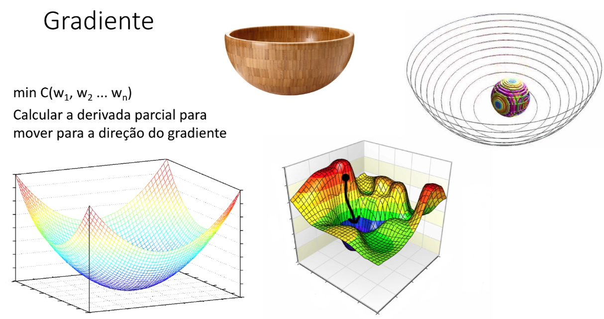
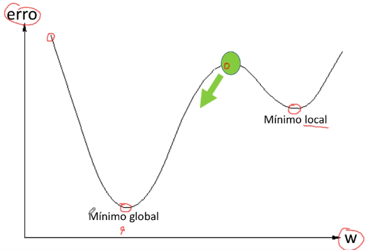
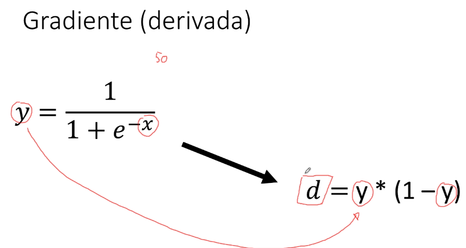

# Decida do gradiente ou Loss Function (continuação da atividade de redes multicamadas - cálculo do erro )

## gradiente

Após fazer o calculo do erro nós precisamos ter um algoritmo que vai efetivamente saber ajustar qual é o melhor conjunto de pesos. Uma rede neural tem a premissa básica de fazer esse procedimento, calcula o erro depois atualiza os pesos e vai rodando por várias épocas até que esse valor do erro seja pequeno.

### Explicação do nome

Nesse exemplo temos a ideia da região de um pico de erro marcado com o vermelho que indica que o erro está alto e precisamos encontra pesos que ele vai descendo até chegar na base em azul onde o erro é pequeno.Por isso ele é chamado de **Decida do gradiente**.

### calculo

Temos **min C** que significa **custo** podemos chamar também de **função de custo** ou **Loss function** (função de perda) que é a maneira de como vamos fazer a atualização de peso.

### Matemática

É preciso calcular a derivada parcial dos pesos. Esse calculo da derivada vai ajudar a mover os pesos para a direção do gradiente.

Esse calculo é utilizado para:

- Encontrar a combinação de pesos que o erro é o menor possível
- o Gradiente é calculado para saber quanto ajustar os pesos.

## mínimo global x mínimo local

O peso precisa se deslocar até o **mínimo global** e não o **mínimo local** e o calculo do gradiente ajuda a deslocar o valor do peso até o mínimo global.

Ele vai calcular o declive da curva com derivadas parciais.

## Exemplo do calculo

Para fazermos o calculo da derivadas nós pegamos o **y** que é a resposta da função sigmoid.

Vamos supor que temos o valor de **50** e passamos esse valor para o **-x** e ele ira retornar um valor em **y** e você pega esse valor **y** e você leva para a função de gradiente e onde estiver **y** você substitui pelo valor e assim você tem o calculo da derivada. E esse valor **d** que ira dizer a direção que vai percorrer no gradiente se vai aumentar ou diminuir o valor do peso.

