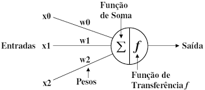
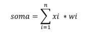
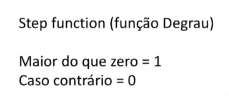
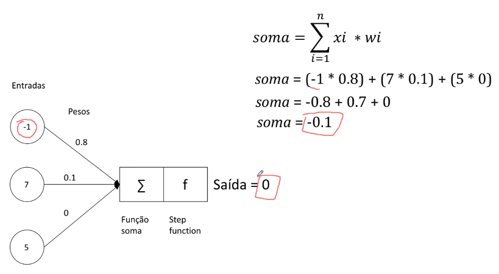
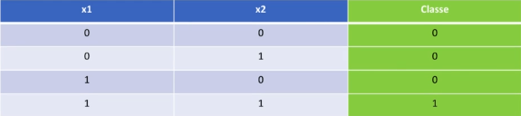
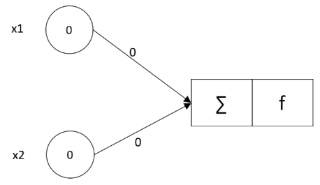
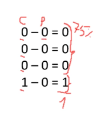
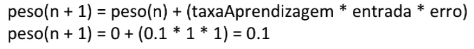
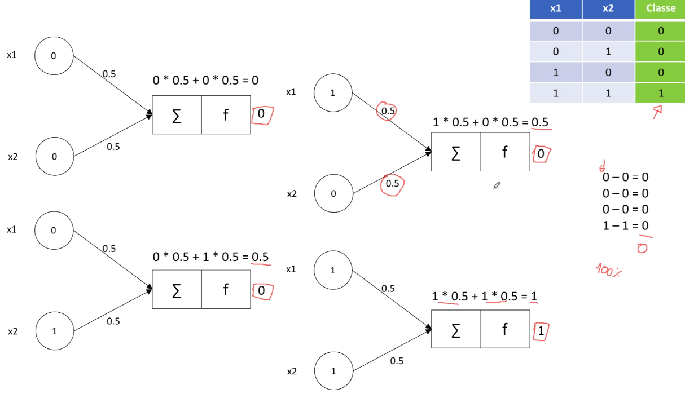

# Perceptron de somente uma camada

## Neurônio artificial

Neurônio de uma camada

A função de soma é: **xi \* wi** é a _entrada_ multiplicada pelos respectivos _pesos_.

**função de ativação**: faz com que quando o valor da soma for maior do que 0 ele vai retornar 1 e caso contrário vai retornar 0.
Essa função que define se a saída será 1 ou 0.

Exemplo de soma para um valor negativo

## Exemplo prático:

Operador E (tabela verdade)

Queremos construir uma rede neural que nos ajude a fazer a previsão desse operador lógico **class** deverá ser a saída pretendida.
Vamos supor que os pesos iniciais começaram com 0 para todos os 4 registros de entrada da tabela verdade.

precisamos agora medir se a nossa rede neural simples se ela está se adaptando bem a esse dados, vamos pegar a seguinte tabela que tem na **primeira coluna** as **respostas corretas** que colocamos na **Classe** que já sabemos qual que é
e em seguida temos na **segunda coluna** as **respostas previstas** que são as resposta que essa rede neural obteve usando o peso 0 para todas as linhas. Na **terceira coluna** temos o **valor de erro** que é a subtração dos valores que no nosso caso deu 1.Com isso podemos afirmar que o neurônio artificial usando o peso 0 acertou **75%**.

Mas nós queremos que a rede neural acerte **100%** para isso podemos usar essa fórmula:

Resultado correto onde a rede neural consegue acertar **100%** dos valores utilizando o peso **0.5**

APRENDIZAGEM EM UMA REDE NEURAL É EFETIVAMENTE DESCOBRIR QUAIS SÃO OS PESOS QUE VÃO SER UTILIZADOS QUE QUANDO VOCÊ FAZER ESSA MULTIPLICAÇÃO VOCÊ TERÁ O RESULTADO DE UMA PREVISÃO QUE DEVE SER O RESULTADO QUE VOCÊ ESPERA.
