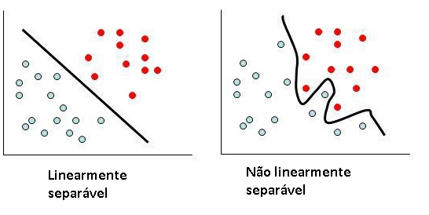
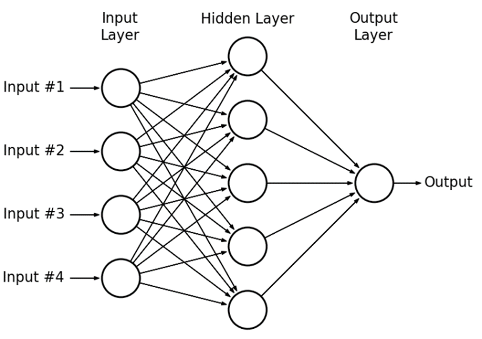
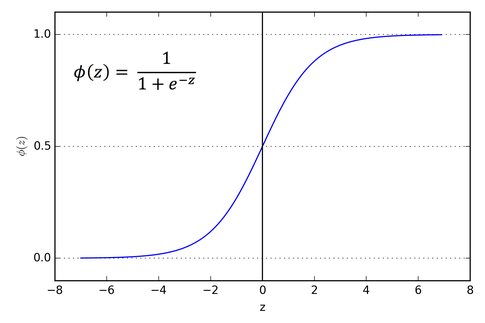
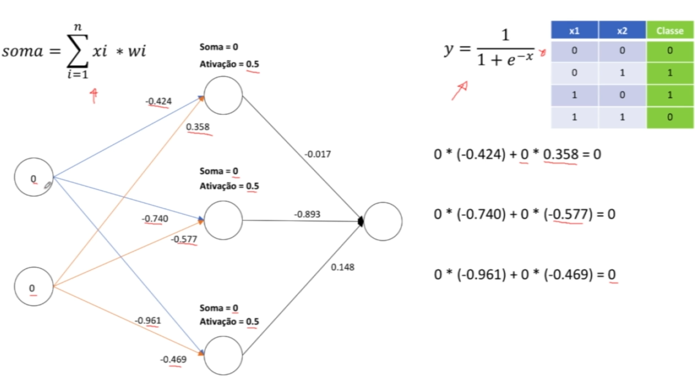
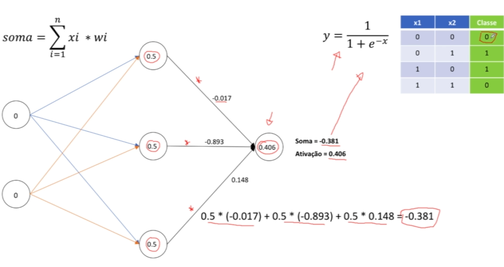

# Redes multicamadas - função soma e função de ativação (continuação da atividade passada do perceptron)

### linearmente separável x não linearmente separável

No cenário de redes multicamadas podemos ter um problema chamado de **não linearmente separável** então nesse caso usamos redes multicamadas e usamos a técnica do perceptron de uma camada simples para problemas **linearmente separável**.

Na maioria dos problemas mais complexos que requerem a utilização de deep learning eles são **não linearmente separável** então é necessário ter estruturas mais complexas para fazer a rede neural aprender os pesos.
Isso ocorre porque a **step function** do perceptron simples retorna somente 0 ou 1.

### Redes multicamada (multilayer perceptron)

Para resolver esse problema que temos as redes multicamadas em que nós temos uma camada escondida no meio.
obs: quando trabalhamos com deep learning podemos ter várias camadas nesse meio.

Uma das funções de ativação mais utilizadas em redes neurais é a **sigmoid function**.

Quando trabalhamos com uma rede neural os peso são inicializados aleatoriamente, veja nesse exemplo
como acontece a verificação em multicamadas: Os dados da primeira linha passam primeiro pela **função soma**
assim como ocorre no perceptron simples e em seguida o resultado da função soma passa pela **função de ativação**
(sigmoid function) isso ocorre para todos os registros, no final teremos todos os valores de _soma_ e _ativação_ ->

Depois que nós temos os valores de ativação calculados agora esses valores referenciam os valores de entrada,
agora esses valores de ativação passam pelo mesmo processo de passar primeiro pela função soma que no exemplo pega o
valor 0.5 e multiplica pelo valor de peso -0.017 e assim faz para os outros valores até obter o resultado de toda a soma
que é 0.381. Após esse processo também precisamos passar o resultado em uma função de ativação, submetendo o valor da soma
em uma função de ativação temos 0.406. Esse neurônio que está na camada de saída tem a resposta final para esse primeiro registro.
Mas perceba que o esperado é recebermos um 0 e o resultado foi 0.406 isso diz que temos um erro grande e isso implica na acurácia pois o valor de saída deve ser o mais proximo do esperado. É feito os cálculos para todos os registro (x1 e x2) até o final dos inputs feito isso já está concluída a primeira rodada da rede neural e ela já fez as previsões para cada um dos
registros.

veja como funciona o calculo de erro no próximo arquivo **redesMulticamadas2** ->
