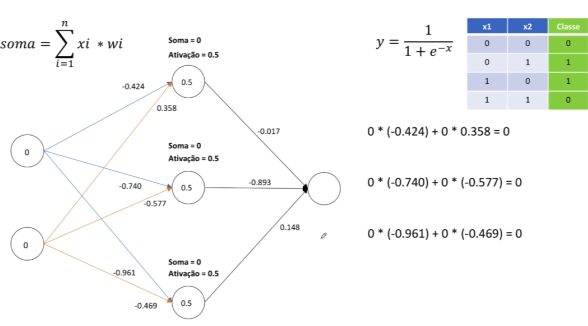
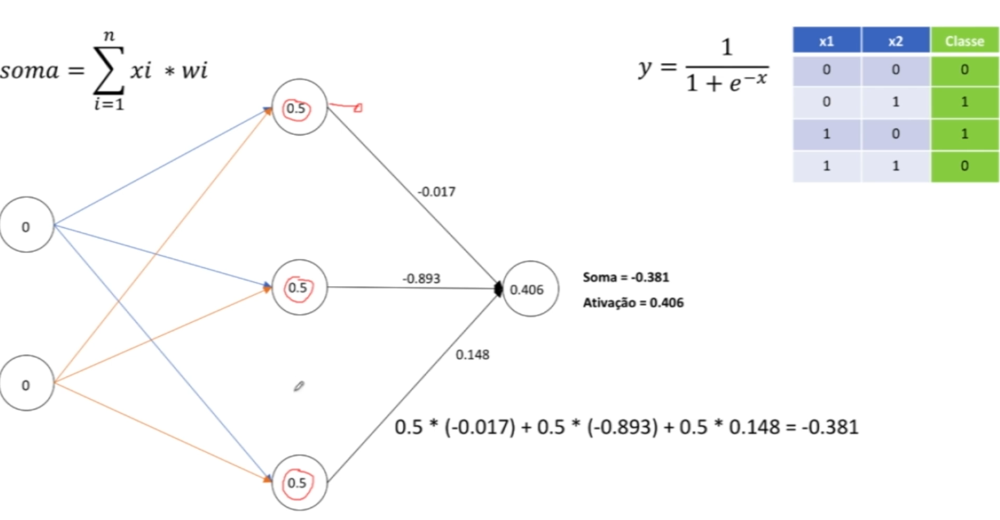
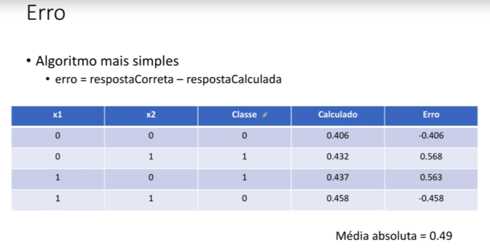

# Redes multicamadas - cálculo do erro (continuação da atividade passada de função soma e função de ativação)

## passo 1

Resultado do treinamento passado onde temos o resultado da função soma mais a função de ativação (sigmoid) que está na camada oculta, repetimos esse processo para cada um dos quatro registros

## passo 2

Após isso fizemos o calculo fluindo da camada oculta e aplicamos uma nova rodada com a função soma + a função de ativação (função sigmoid). Com isso chegamos no resultado de 0.406 que efetivamente é onde está a resposta da rede neural. Isso é feito para os 4 registros.

## passo 3

Em seguida fazemos o cálculo do erro para isso basta pegarmos a resposta correta e subtrair para a resposta calculada.
Nesse exemplo seria: [ 0 - 0.406 = -0.406] [1 - 0.432 = 0.568]... e assim por diante.
Para eu saber o total de erro eu posso fazer a somatória de todos esses valores e extrair a média absoluta (não considerando o sinal negativos).

media = somatório dos erros / 4 (0.49).

Esse valor indica que temos 49% de erro com isso podemos afirmar que essa rede neural com esses pesos aleatórios iniciais ela tem o acerto de somente 51% e o nosso objetivo quando estamos trabalhando com redes neurais é sempre diminuir esse valor **0.49**. Quando você atinge valores com **0.01** são valores interessantes.

## Resumo

Iniciamos uma rede neural com conjunto de pesos aleatórios e em seguida fizemos todo esse procedimento dos valores indo passando pelas camadas que realizam seu calculo (no nosso caso foram apenas 2 funções de calculo uma de soma e a outra sigmoid). Após isso faz o calculo do **erro** e o que ele vai precisar fazer logo após é efetivamente ajustar esses pesos. Ele precisa ir buscando pesos melhores para que esses dados eles consigam se adaptar melhor aos pesos.

A aprendizagem em uma rede neural é efetivamente você encontrar qual é o melhor conjunto de pesos e com isso levamos como base o calculo do erro.

## proximo passo

Usar um algoritmo para automatizar o ajuste dos pesos **descidaDoGradiente**
