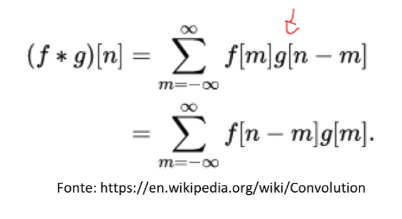
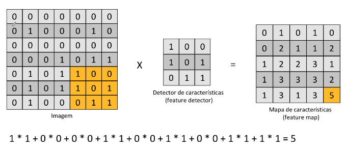
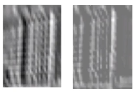
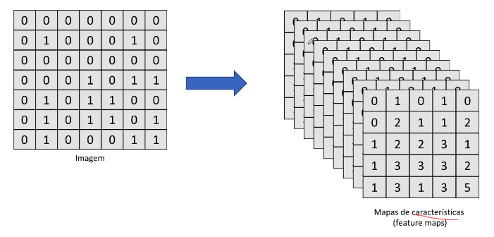

# Etapa 1 - Operador de convolução

- Convolução é o processo de adicionar cada elemento da imagem
  para seus vizinhos, ponderado por um kernel: Cálculos e soma de
  matrizes para fazermos alteração de determinados pixels da imagem
  que é ponderado por um kernel.

- A imagem é uma matriz e o kernel é outra matriz.

## Links

- Explicações sobre os kernels
  [wikipedia Kernel_image_processing ](<https://en.wikipedia.org/wiki/Kernel_(image_processing)>)

- Exemplo on-line [setosa image-kernels](https://setosa.io/ev/image-kernels/)

A ideia de trabalhar com o pré processamento em uma rede convolucional é
na primeira etapa pegar a imagem original e fazer a aplicação desses tipos
de kernels para ele fazer a modificação na imagem e começar a eliminar
características que não são essenciais para o treinamento.

## Operação

matriz da imagem x matriz feature detector (detector de características) = feature map (Mapa de características).
Aqui reduzimos a dimensionalidade de 49 pixels para 25 pixels.

- Com o mapa das características (filter map) a imagem fica menor para
  facilitar o processamento.
- Alguma informação sobre a imagem pode ser perdida, porém o propósito é detectar
  as partes principais (quanto maior os números melhor).
- O mapa de características preserva as características principias da imagem
  (olho, boca, nariz, etc.)

## Função RELU

A função Relu é aplicada em seguida depois que é feito a extração de características.
Essa função é aplicada em cada uma das células, ela transforma os valores negativos
em 0 e se você tiver um valor 0 ou maior que 0 ele simplesmente vai manter o valor.

- Essa função ajuda a detectar melhor os padrões tirando as partes mais escuras
  e deixando-as mais claras.

  

## Camada de convolução

Aplicação dos mapa de características.

