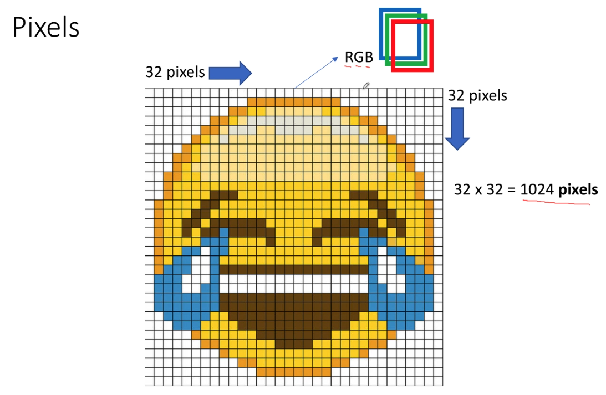
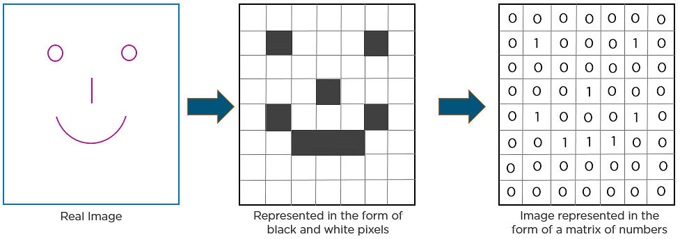
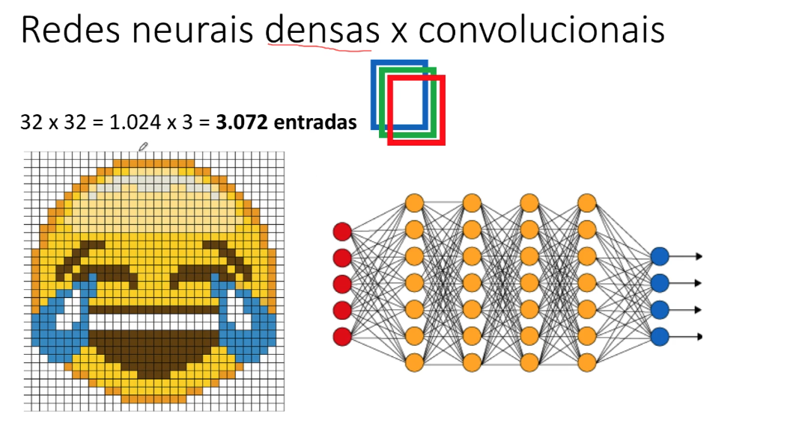

# Redes neurais convolucionais (CNN)

- Usado para visão computacional
- Carros autônomos, detecção de pedestres, detecção
  de objetos (umas das razões por deep learning funcionar bem)
- Em geral, melhor do que SVM (support vector machines)

## Pixels

Você lê toda a imagem e passa cada pixel para uma camada de entrada do neurônio.
E a rede neural vai fazer toda a questão do aprendizado exatamente como as
redes neurais densas. E com base nisso ele vai fazer a previsão da resposta.

## Redes Neurais Densas x Convolucionais

Se você tiver muitas entradas a sua rede neural será lenta

## Convolucionais

Redes convolucionais

- Não usa todas as entradas (pixels)
  - seleciona automático os melhores pixels
- Usa uma rede neural tradicional mas no começo transforma os dados na camada de entrada
  - a diferença é somente na entrada é necessário fazer um pré processamento na imagem.
- Quais são as características mais importantes?

  - A rede convolucional tem o objetivo de responder essa pergunta automaticamente.

- Caso você use uma rede neural tradicional você tem que passar todos os pixels
- Caso você utilize uma rede neural convolucional antes da chamada inicial da rede
  neural e passar os parâmetros da entrada, você vai fazer um pré processamento em
  todas as imagens para descobrir as características mais importantes.

## Reflexões (CNN)

- Quais características utilizar?
  - Ela mesmo vai descobrir
- Para faces
  - Localização do nariz
  - Distância entre os olhos
  - Localização da boca
- Como diferenciar uma face humana de um animal?
  - cnn vai descobrir essas características

## etapas

- Etapa 1: Operador de convolução
- Etapa 2: Pooling
- Etapa 3: Flattening
- Etapa 4: Rede neural densa

etapas 1,2 e 3 são de pré processamento da imagem.
