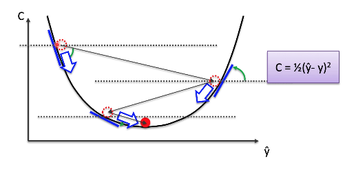
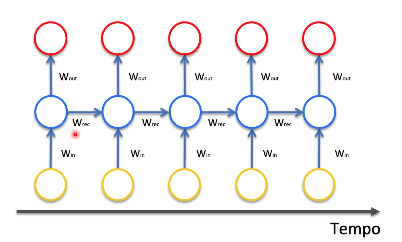
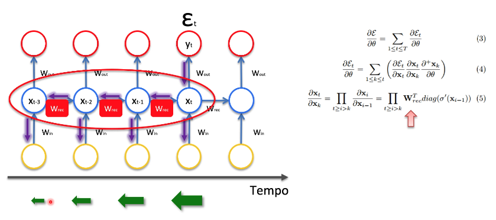
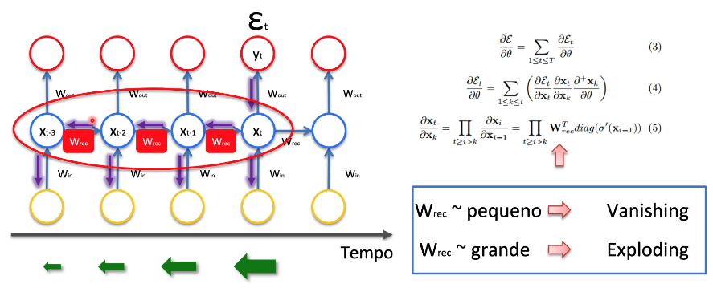

# Vanishing Gradient (Gradiente Desaparecendo)

**C** significa função de custo. Essa formula é do minimum score error,
onde pegamos a resposta prevista menos a resposta real elevamos ao quadrado
e dividimos por dois.

### W significa Weight

Aqui seria como se você quisesse prever qual é a palavra que você vai falar
agora com base nas cinco últimas palavras que você falou. Ou prever
o preço da ação hoje com base no preço da ação dos 5 últimos dias.

- **Win** pesos da camada de entrada.
- **Wrec** pesos que estão fluindo no loop das camadas ocultas. Com esse peso que iremos trabalhar em uma rede neural recorrente.
- **Wout** pesos que fluem para a camada de saída.

É passado uma entrada na camada de _Win_ e ele vai propagando para todo
o restante da rede e esses valores **E t-3...** é como se fosse o a função de erro.

Para medir o desempenho é medido as saídas que estão nessa camada vermelha
com as saídas que já estão na base de dados é a ideia da aprendizagem supervisionada, onde você já tem os dados corretos e as saídas serão comparadas
com os dados que você tem na base de dados.

**Many to Many**

## Problem

O problema está no **Wrec** que é o peso recorrente que é usado para conectar
as camadas escondidas com elas mesmas quando é feito o desenrolar do loop
temporal. Quando fazemos o ajuste do peso _Wrec_ nós precisamos fazer uma
multiplicação e a cada vez que fazemos essa multiplicação ele vai diminuindo
o valor e quando você diminui muito esse valor quer dizer que a influência dos
últimos neurônios vai ser praticamente insignificante. Você não vai conseguir
atualizar esse pesos porque o valor é muito pequeno então a influência deles
não vai ser grande e você pode chegar a conclusão que eles não foram treinados
adequadamente e se eles não foram treinados adequadamente a tendência da rede
neural como um todo é que ela não seja boa.

Se o Wrec for pequeno é o problema do **Vanishing**.
Se o Wrec for grande é o problema do **Exploding gradient**

## Soluções

1. **Exploding Gradient**

- Truncated Backpropagation - Ele para a retro propagação em um certo tempo porem ele gera outro
  problema que é que os pesos não serão atualizados totalmente.
- Penalidades
  - Se ele passar de um determinado valor que você define você da
    uma penalidade e diminui o valor dele.
- Gradient Clipping
  - Você pode utilizar tanto para o Exploding quanto para o Vanishing
    onde você pode definir valores minimus e valores máximos.

2. **Vanishing Gradient**

- Echo State Networks
- Inicializa dos pesos
- Long Short-Term Memory Networks (LSTMs)

## Artigos

- Untersuchungen zu dynamischen neuronalen Netzen
  Sepp (Josef) Hochreiter (1991)

- Learning Long-Term Dependencies with Gradient Descent
  is Difficult Yoshua Bengio et al. (1994)

- On the difficulty of training recurrent neural networks
  Razvan Pascanu et al. (2013)
