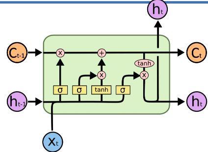
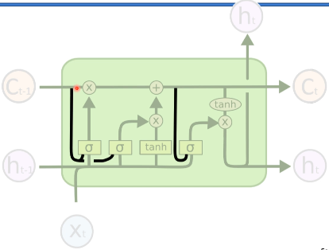
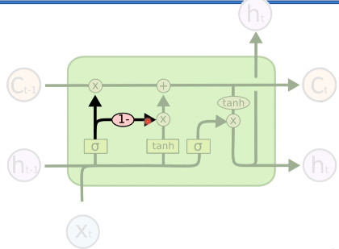
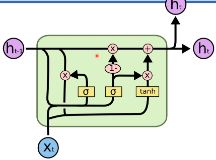

# Variações de LSTM

- figura original

1. Primeira variação da passada de dados

- Ele pega o que está na memória e vai decidir se vai manter, remover
  ou vai passar pra frente.

2. Segunda variação de passada de dados

- Existe uma variação entre a forget gate (excluir) e a memory gate (adicionar).

3. Terceira variação de passada de dados GRU(Gate Recurrent Units)

- Ele não tem o valor do _C_ célula de memória pois ele trata esse valor junto
  com o _h_, então junto com as saídas também fica a célula de memória.

- Essa arquitetura é menos flexível do que a LSTM.

- A LSTM para a maioria dos problemas mais complexos ela tem dado resultado
  melhores e mais interessantes do que a estrutura GRU.

# Artigos

- LSTM: A Search Space Odyssey - Klaus Greff et al. (2015)
  [LSTM: A Search Space Odyssey](https://arxiv.org/pdf/1503.04069.pdf)
