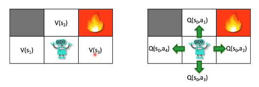
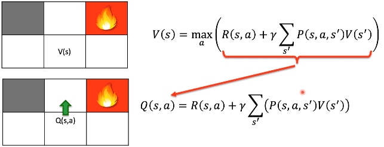
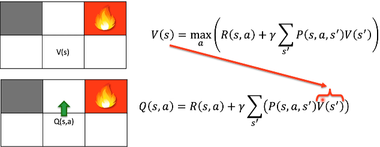
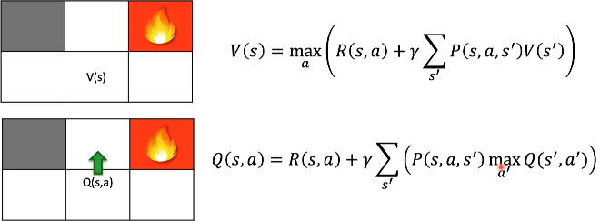

# Q-Learning Intuição

Na primeira abordagem que é o **V(s)** estamos pegando o valor máximo de todas
as possiveis ações que na fórmula está representada pelo *max*.
E agora temos o valor de *Q* que baseado em uma ação ele vai para um determinado
estado e esse Q vai definir qual a qualidade da ação (qual a ação é mais lucrativa).

- O **Q** está mais relacionado a recompensa.
- O **V(s)** é o máximo de todos os possíveis valores de Q.

Toda essa parte que está dentro do parentese equivale ao cálculo do *Q* que é a 
recompensa somando com multiplicação do gama veses o somatório dessas probabilidades,
lembrando que a última parte da fórmula indica aleatoriedade do ambiente. 

A única coisa que mudamos é a términologia da fórmula que agora colocamos o 
**maxQ** que é o maior valor de *Q*.

# Leitura

[Markov Decision Processes: Concepts and Algorithms - Martijin van Otterlo (2009)](https://citeseerx.ist.psu.edu/document?repid=rep1&type=pdf&doi=968bab782e52faf0f7957ca0f38b9e9078454afe)