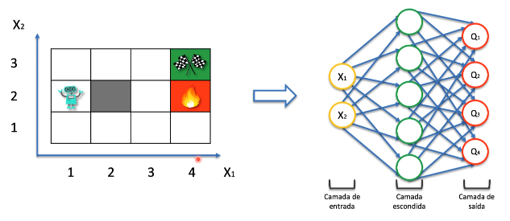
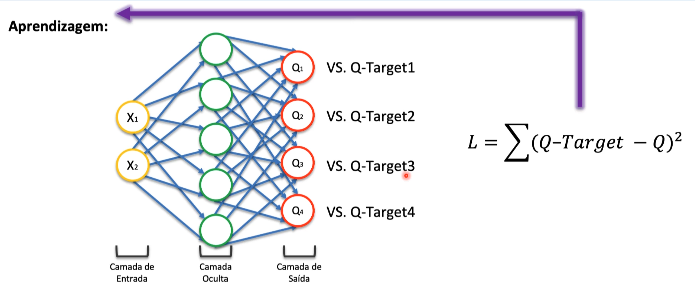
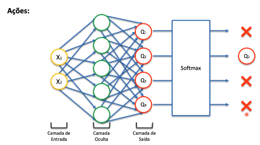
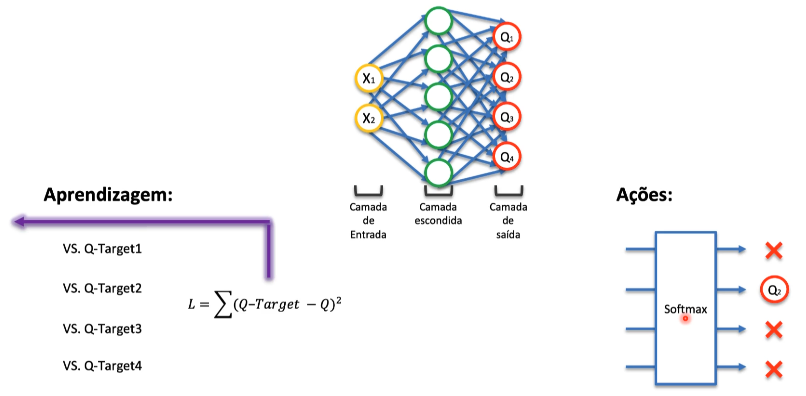

# Intuição Deep Q-Learning - Aprendizagem

O Q-Learning clássico ele em geral vai ser executado com sucesso em ambiente
mais simples e ele não vai funcionar muito bem em ambiente mais complexos com
por exemplo em carro autônomos ou então com jogos. Para trabalhar com problemas
mais complexos precisamos usar o **Deep Q-Learning** utilizando redes neurais.

O que acontece agora para a previsão do **Q** da ação é que ele compara a previsão
da rede neural com o valor da previsão anterior.

Nós precisamos também calcular a função de **loss function** que é a função de
erro nessa função ele pega o **Q-Target** que é os valores anteriores que nós
tinhamos e fazemos a subtração com os valores de **Q** que são as previsões da
rede neural e elevamos ao quadrado que é o cálculo de **mean squared error**.
Então após feito o somátorio pegamos esse valor e passamos para o inicio da rede
neural, e ele ira executar por *x* épocas até que ele consiga aproximar esses
valores de *Q*.

observação: nos métodos passados precisavamos que o *antés* precisaria ser muito
próximo do *depois* por meio daquela fórmula da diferença temporal e aqui nós 
temos um conceito bem parecido, o que vai mudar é que nós vamos comparar as 
respostas que nós tinhamos antés com as previsões das redes neurais e nós temos
o adicional que é o uso da **loss function** para nós fazermos essas repetições e
esses ajustes dos pesos. E na próxima vez que o agente estiver andando pelo 
ambiente ele já vai ter acesso aos pesos da rede neural o que vai mudar em qual
ação o agente deve tomar. 

# Intuição Deep Q-Learning - Ações

Em relação as ações vamos usar a função **Softmax** que retorna uma probabilidade. O que ele vai fazer é selecionar o estado que tem o 
maior valor.

Durante as interações do agente no ambiente nós vamos precisar fazer
o processo de **aprendizagem** e o processo de **tomada de decisão** e
depois que ele toma uma ação o processo continua, a cada vez que o agente
morre ou ele termina em uma posição certa é considerado uma *nova época* e 
o processo ocorre a cada vez que agente está em um novo estado.

Todo esse processo de aprendizagem e tomada de decisão acontece toda vez
que o agente muda de um estado para o outro, a rede neural faz a aprendizagem
e ele já vai tomar uma decisão utilizando a função softmax. Esse processo
não acontece para cada um dos jogos, quando ele completa o jogo mas sim
esse processo vai acontecer para cada um dos estados.

# Leitura adicional

[Simple Reinforcement Learning with Tensorflow (Part 4) - Arthur Juliani (2016)](https://awjuliani.medium.com/simple-reinforcement-learning-with-tensorflow-part-4-deep-q-networks-and-beyond-8438a3e2b8df)
