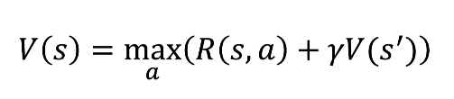
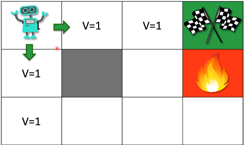
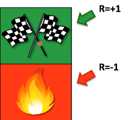
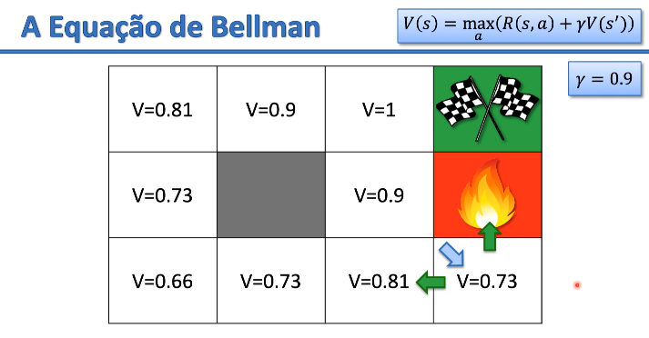

# Equação de Bellman 

Os conceitos chave do aprendizado por reforço são:

- s - Estado
- r - Ação
- R - Recompensa
- γ - Desconto

**Richard Ernest Bellman** criou esses conceitos de programação dinâmica em 1953
esse algoritmos são muito usados em *estrutura de dados*.

**V(s)** é a trilha de valores de estado por onde o agente passou até ele ganhar sua última recompensa. Ele vai calcular qual é o valor que deve estar dentro daquele estado, se for negativo é o sinal que o agente usa para não passar por lá.

**R(s,a)** tomando uma ação *a* eu vou para um estado *s* e vou ganhar uma recompensa *R*.Essa parte da formula indica qual será a recompensa que o agente
vai ganhar por ele se movimentar por aquela direção (ação), essa ação pode ser ir
para cima, para baixo, para direita ou para esquerda ser um número que vai pra cima (somar) ou para baixo (subtrair). 

Ele não ganha recompensa somente por passar por aquela direção a recompensa ou
a punição é dada somente no final quando ou ele alcança o objetivo ou morre.

**max a** de acordo com o ambiente e os limites de movimentação é o valor maximo de ações/direções que o agente pode seguir. Se for somente duas ações ir pra cima
ou para baixo, direita ou esquerda o valor alternaria entre 0 e 1. Ele sempre
vai calcular o valor máximo antés de adicionar um valor naquele bloco da trilha.

**somatório V(s')** É feito um somatório da recompensa obtida mais o novo estado 
o *s'* significa o estado seguinte que é as ações que ele pode tomar.

A ideia é o agente seguir a onde estão os maiores valores:

O **gama γ** fator de desconto pode ser configurado no algoritmo, ele serve para achar qual a ação você deve seguir. Quanto mais longe de 1 menor é o valor por 
onde ele deve seguir quando mais perto de 1 maior é o valor por onde ele deve seguir, o agente segue a trilha com o valor maior comparando com o seu estado atual.

# Leitura

[The Theory of Dynamic Programming - Richard Bellman (1954)](https://www.rand.org/content/dam/rand/pubs/papers/2008/P550.pdf)