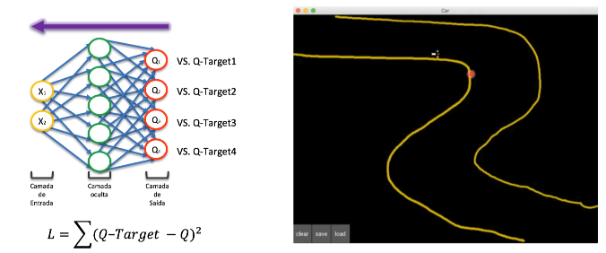

# Experiência de Replay

A experiência de replay não vai colocar todas as entradas na rede neural,
ele vai salvar na memória do agente uma sequência de ações e quando chegar 
em um determinado valor o agente decide fazer a aprendizagem novamente.

Por exemplo se você definir um *patch* de 100 pixels, o agente vai armazenar
os dados desses 100 pixels ou 100 ações na memória do agente e quando ele chega
nesse valor ele vai passar para a rede neural fazer todo o treinamento dessa
forma vai evitar o *overfitting*.

Nesse exemplo de carro autônomo o agente aprende a dirigir na reta, depois a reta
com a curva,de 100 e 100 pixel ele vai aprendendo a dirigir no ambinete.

Conseguimos resolver esse problema do ambiente divindindo
em batch e como se a gente estivesse extraindo amostras de todo o percurso,
ao invés de passar para a rede neural o percurso completo.

Observação: o agente vai aprender a dirigir mais rápido nos ambientes que 
tem mais amostras no cenário e vai demorar um pouco mais onde tem menos
amostra:

# Leitura

[Prioritized Experience Replay - Tom Schaul et al., Google DeepMind(2016)](https://arxiv.org/pdf/1511.05952)
