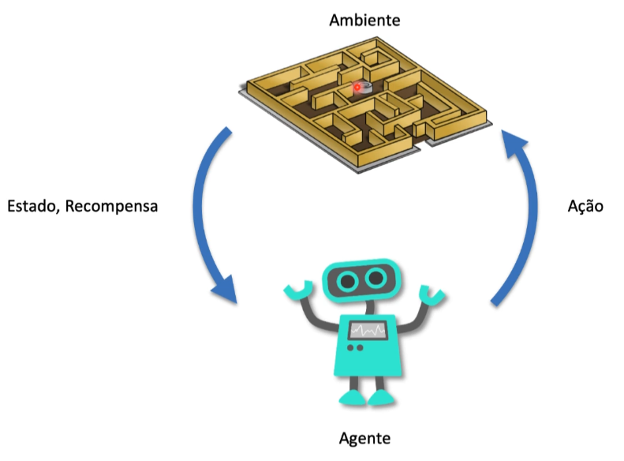

# O que é aprendizado por reforço ?

A diferença do aprendizado por reforço e o aprendizado supervisionado é que a inteligência artificial (**agente**) vai aprender por meio de interação com o **ambiente**, por meio desse processo repetitivo de tentativa e erro (**recompensa x punição**) o agente aprendera explorando o ambiente, ele vai aprender quais **ações** levam para uma maior recompensas.

# Artigos 

- [Simple Reinforcement Learning with Tensorflow (10 Parts) - Arthur Juliani (2016)](https://awjuliani.medium.com/simple-reinforcement-learning-with-tensorflow-part-0-q-learning-with-tables-and-neural-networks-d195264329d0)

- [Reinforcement Learning I: Introduction - Richard Sutton et al. (1998)](https://citeseerx.ist.psu.edu/document?repid=rep1&type=pdf&doi=e66ff7b379b476b90422bf363361b5380ee4049d)

