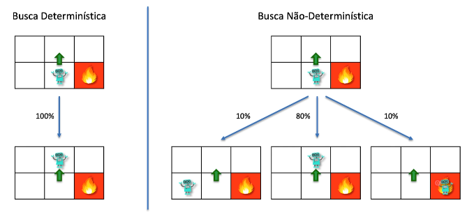
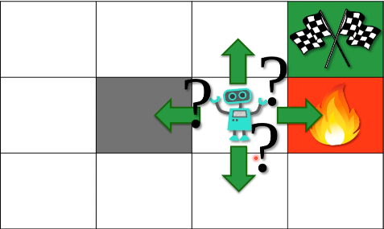
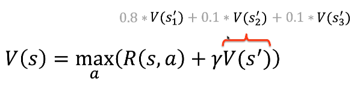
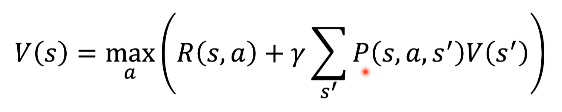

# Markov Decision Process (MDP)

Processo estocástico onde a ideia é simular o que realmente aconteceria no mundo
real. Isso quer dizer que nem sempre ir no mesmo lugar vai ser a melhor opção a
se tomar, nem sempre vamos ter 100% de certeza sobre uma determinada ação.

- Busca Determínistica
- Busca não-determínistica

### Markov Process

Um processo estocástico possui a propriedade Markov se a distribuição de 
probabilidade condicional de estados futuros do processo (condicionoal em
estados passados e presentes) depende apenas do estado presente, não da sequência
de eventos que o precedeu. Um processo com essa propriedade é chamada de processo 
de Markov.  

*Wikipedia (taduzido para português)*

A escolha das proximas ações a se tomar no ambiente somente dependera de onde
você está agora, não dependera de como você chegou naquele estado presente.
As decisões passadas não importam nesse processo estocástico que tem essa propriedade
de Markov.

### Markov Decision Process (MDP) - Processo de Decisão de Markov

Fornecem uma estrutura matemática para modelar a tomada de decisões em situações
onde os resultados são parcialmente aleatórios e parcialmente sob o controle de um 
tomador de decisão.

*Wikipedia (taduzido para português)*

Agora se o agente decidir ir para cima ele ainda saberá que existe probabilidades
de ir para algum desses lados: 

o MDP é o framework que ajudará ele a decidir o que fazer nesse ambiente, dessa
forma nós temos um ambientes estocásitco com fator randomico e o agente precisa
tomar essa decisão de para onde ele vai.

Nós podemos adicionar o MDP na equação de Bellman. Coloconado o na última parte
multiplicando todos os estados apartir do estado presente do agente.

Por mais que tenha uma probabilidade de o agente seguir em um determinado estado
pode ser que ele precise ir para algum dos outros estados que tenha uma probabilidade
menor.

- **Quando temos somente um V é uma busca deterministica** porque sabemos para qual estado o agente está indo.

- **Quando usamos o MDP no V é uma busca não-deterministica** porque não sabemos qual o estado  scolhido, por isso usamos essa formula para buscar o valor esperado do estado.

**P(s,a,s')** indica a probabilidade de estar em **s** tomando a ação **a** e 
estar no estado **s'** multiplicado pelo valor do estado futuro **V(s')**.

obs: Nós precisamos dessa operação porque em ambientes reais principalmente em 
jogos nós não temos uma ação fixa para tomar.

# Leitura

[A Survey of Applications of Markov Decision Process - D.J. White (1993)](https://www2.it.uu.se/edu/course/homepage/aism/st11/MDPApplications3.pdf)