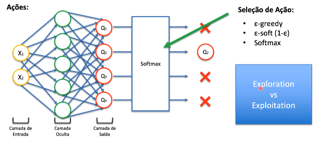
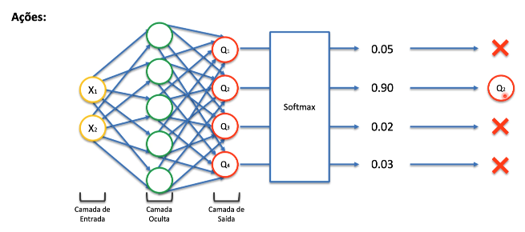

# Política de Seleção de Ações

Para trabalharmos com a seleção de ações nós temos várias formas:

- ∈-greedy (busca gulosa)
- ∈-soft (1-∈)
- Softmax

## Exploration vs Exploitation

O **exploration** indica que o agente sempre vai continuar explorando
o ambiente apesar dele ter uma alta probabilidade de tomar uma 
determinada ação.

O **exploitation** é o agente continuar fazendo as ações boas, quer
dizer que ele acaba ficando viciado em sempre executar aquela mesma ação,
acaba que ele não vai explorar tanto o ambiente.

É interessante unir esses dois conceitos do agente continuar executando
as ações que já são boas mas nunca parar de explorar o ambiente para 
eventualmente ele encontrar uma ação melhor. E a união desses dois 
conceitos pode ser considerado o **núcleo da aprendizagem por reforço**.

Se o agente para de explorar o ambiente ele pode ficar preso no *máximo local*
ele vai para uma ação que é boa porem existe ações melhores se ele tivesse explorado o ambiente com mais frequência e para isso nós precisamos de uma
política de ação que vai permitir que o agente não fique preso nesses máximos
locais.

## Seleção de Ação

- **∈-greedy (busca gulosa)**

**∈** é um parâmetro que indica uma probabilidade.

Supondo que você coloque o valor de 0.1 (10%) quer dizer que ele
vai selecionar a melhor ação em 90% das situações e em 10% das situações
ele vai selecionar uma ação randomica. E isso é uma maneira de explorar
o ambiente.

- **∈-soft (1-∈)**

Bem similar ao ∈-greedy, aqui se você passar o valor de 0.1 (10%) em
10% das vezes ele vai escolher a melhor ação e em 90% das vezes ele vai
selecionar uma ação randomica que também é uma maneira de trabalhar com a
exploração.

- **softmax**

pode ser considerado uma versão mais avançado dessa duas, o motivo
de usar a função de softmax é que ele retorna probabilidades, então 
usamos probabilidades para selecionar as ações. 

# Leitura

[Adaptive ∈-greedy Exploration in Reinforcement Learning Based on Value Differences - Michel Tokic (2010)](https://tokic.com/www/tokicm/publikationen/papers/AdaptiveEpsilonGreedyExploration.pdf)