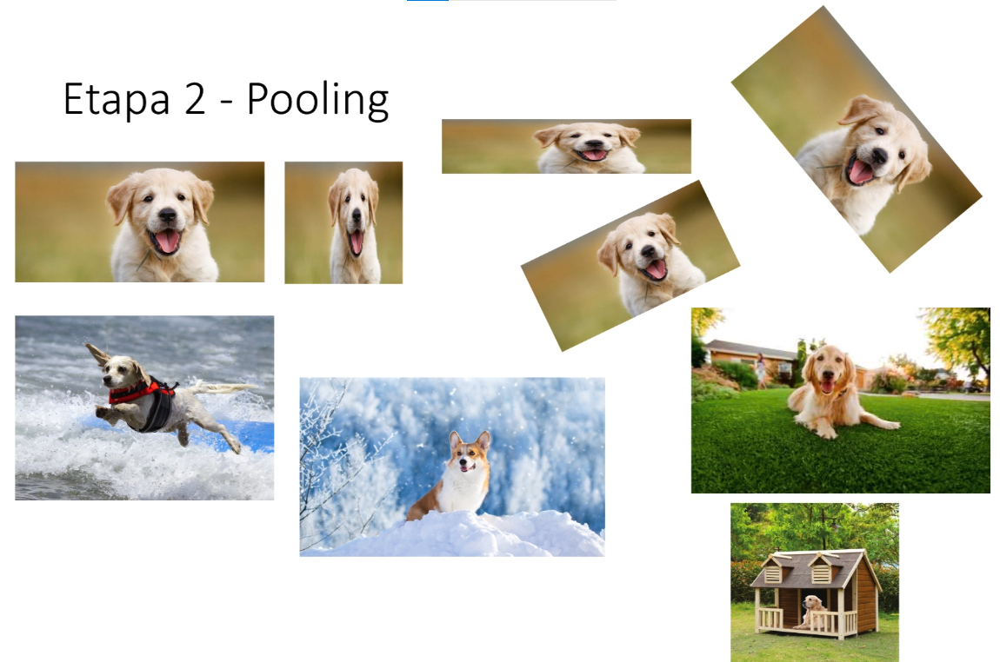
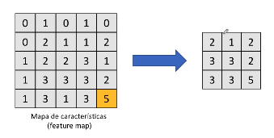
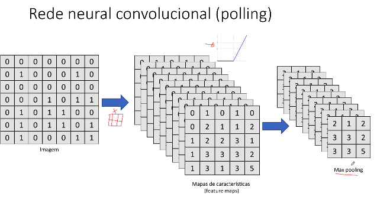

# Etapa 2 Pooling

Essa etapa serve para realçar as características da imagem que você quer
que seja detectado.
ex: Cachorro

## Max Pooling

max pooling: pegar o valor maior pois quanto maior o valor
mais importante ele é.

Isso reduz ainda mais nossa imagem.

- Seleciona as características mais relevantes (reduz overfitting e ruídos desnecessários)
- Max polling (mínimo, média): max foca nas características mais relevantes

