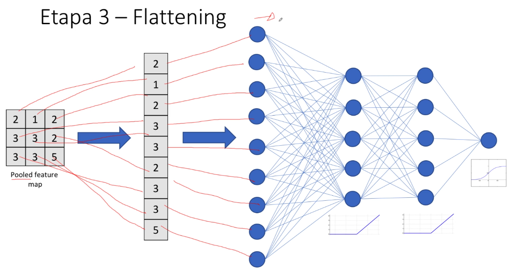

# Etapa 3 flattening

Nessa etapa nós transformamos a imagem do formato de matriz para o formato de
vetor. O motivo de fazer-mos isso é que agora poderemos fazer a utilização da
nossa rede neural densa.

## Link

[Simulador de Rede Neural Convolucional](https://github.com/aharley/nn_vis)
