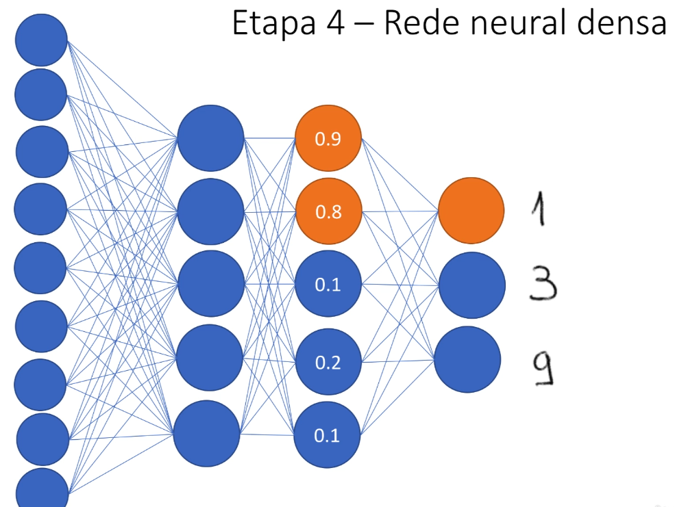
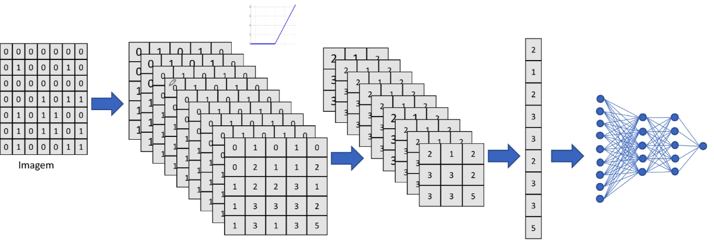

# Etapa 4 Rede Neural Densa

O que a rede neural vai fazer é identificar um padrão, então o que ela vai fazer é que quando chegar aquele valor na última camada oculta o valor de saída vai ser nesse caso 1. Então existe uma tendência para quando chegar aquele valor na camada o oculta o padrão de saída ser esse respectivo valor. A partir disso é aplicado
uma probabilidade para identificar qual classe a imagem funciona.

Resumo de todo o processo:

- Também fazemos o treinamento com a descida do gradiente

Além dos ajustes dos pesos, é feito também a mudança do detector de características.
