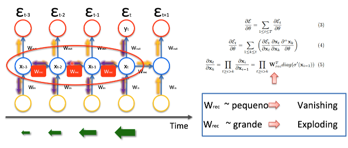
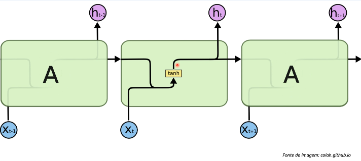
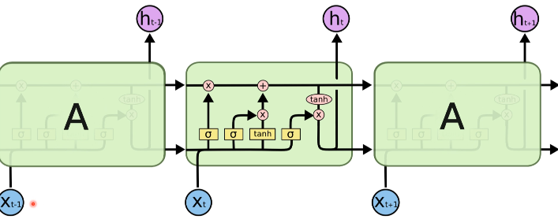
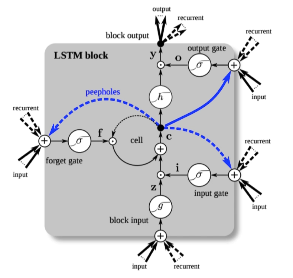
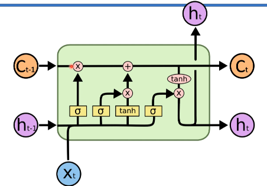
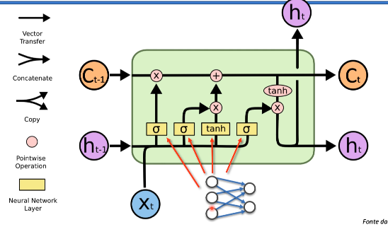

# Long short term memory - LSTMs

É uma das técnicas para resolver o problema do gradiente desaparecendo.

Exemplo de onde acontece esse problema: Se eu quiser retro propagar os pesos
do tempo igual a _t_ eu preciso fazer varias multiplicações nas camadas temporais
anteriores e quanto mais distante é feito esse calculo os pesos tem a tendência
a não fazerem efeito.

### Estrutura de dentro da rede neural recorrente simples

- **Xt** é a entrada.
- **ht** saída no tempo.

O problema está na parte da aplicação da função **tanh** (função de ativação
tangente hyper bolica) que retorna os valores entre menos 1 e 1.

[Understanding-LSTMs article](https://colah.github.io/posts/2015-08-Understanding-LSTMs/)

Estrutura do loop temporal nesse exemplo _t-1_ é passado para _t_,
nessa ele passa o output para fora e também passa o output para frente.

Essa é a estrutura original

### Estrutura do loop temporal

- **h** output.
- **X** input.
- **C** memory cell (célula de memoria).

Os dados são trafegados nesse pipeline de memory cell.
O _x_ nesse pipeline indica que ele pode ser apagado dependendo do resultado,
da função _sigmoid_, dependendo do resultado eu vou apagar da célula de memoria
ou dependendo do resultado eu vou adicionar uma informação a mais que vai trafegar
no restante das camadas.

Uma LSTM tem três entradas que são uma: célula de memoria, output ou saída da
camada anterior e o valor da entrada, e ele tem três retornos também que são:
a própria saída que é como se fosse a resposta final para o usuário, ele vai
passar o _ht_ para a próxima camada e também ele vai passar para a próxima camada
o que está armazenado na célula de memoria.

obs: Ele não vai receber só um valor e sim um vetor de valores.

### Terminologias

Passo a passo de como funciona:

A rede neural recebe a saída da camada anterior mais a entrada atual e
ela é passada para a função sigmoid para decidir se vai manter ou não vai
manter na memória, depois é passado para a outra parte que é a outra função
sigmoid pra tangente (esses dois fluxos vão andar em paralelo) e essa parte
que vai fazer a adição na memória e feito o pipeline da memoria por fim
vai ser gerado as saídas que vai ser mandado para o _ht_ que é a saída final
para o usuário e também o _ht_ que vai mandar para a próxima camada.

### Leitura artigos

- Long Short-Term Memory - Sepp Hochreiter & Jurgen Schmidhuber (1997)
- Understanding LSTM Networks - Christopher Olah (2015)
- Understanding LSTM and its diagrams - Shi Yan (2016)
