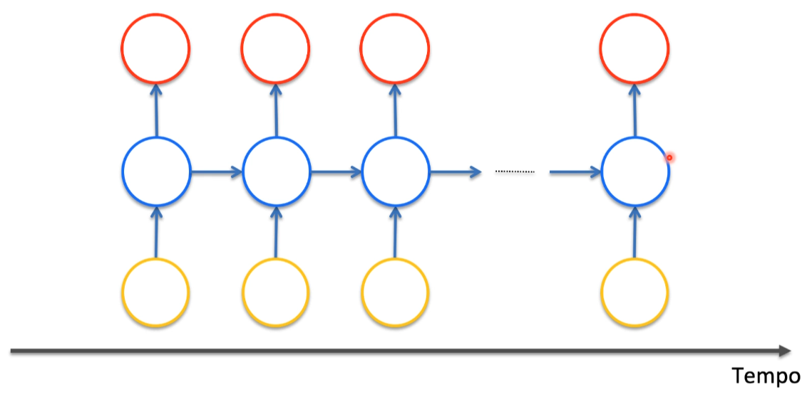

# O que são Redes Neurais Recorrentes (RNNs)

Algoritmo avançado de deep learning que armazena os dados em um
curto espaço de tempo. Ex: saber o preço de uma ação da bolsa de valores.

### Rede Neural Densa

### Rede Neural Recorrente

Quando nós trabalhamos com esse tipo de rede neural nós continuamos
com os mesmo atributos de uma rede neural densa mas agora transformamos
os dados em um único vetor de entrada e um vetor de saída.

obs: cada bolinha representa uma **camada** e não um **neurônio**.

Na literatura você pode ter uma representação na vertical, e para ela ser
recorrente você vai precisar passar a informação anterior para o neurônio
atual (loop temporal), eu tenho uma retro alimentação na camada oculta,
a função de ativação passa o resultado para a camada de saída e também para
a camada oculta e é como se fosse um loop recursivo.

**Exemplo de uma representação simples:**

**Exemplo de uma representação com multi camadas:**

Esse loop temporal em uma rede neural recorrente é uma memória de curto
prazo para que você precise tomar uma decisão do que fazer no momento atual.

# Arquiteturas de redes neurais recorrentes

## One to Many

1 para muitos onde você tem uma entrada somente e o desenrolar no tempo, um
exemplo bastante comum de rede neural recorrente é você colocar legenda em
uma imagem.

Nessa arquitetura você submete a imagem ou entrada e ela já começa a gerar as
saídas.

## Many to One

Aqui nessa arquitetura as saídas serão geradas depois que você passou todas
as entradas, um exemplo de uso e a análise de sentimentos.

## Many to Many

Aqui você passa várias camadas e ela ira retornar várias saídas, um exemplo
é a tradução de idiomas. Nesse contexto depois que você submete a última palavra
é que uma rede neural vai dar as respostas e isso acontece porque para você
fazer a tradução de um texto, você vai precisar ter o texto completo porque
a ordem da palavra pode mudar durante a tradução.

## Many to Many 2

Um exemplo do uso dessa arquitetura é colocar legenda
em filmes.

