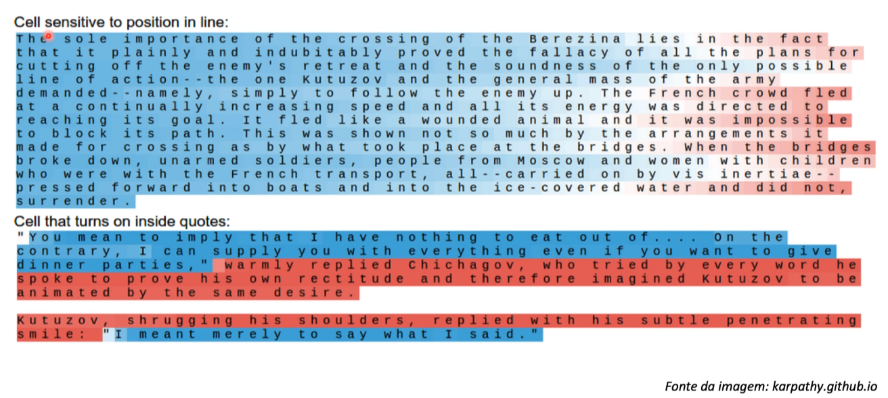
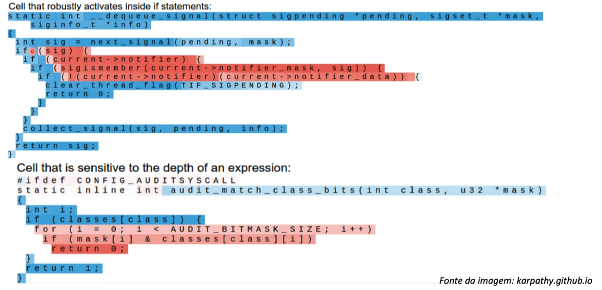
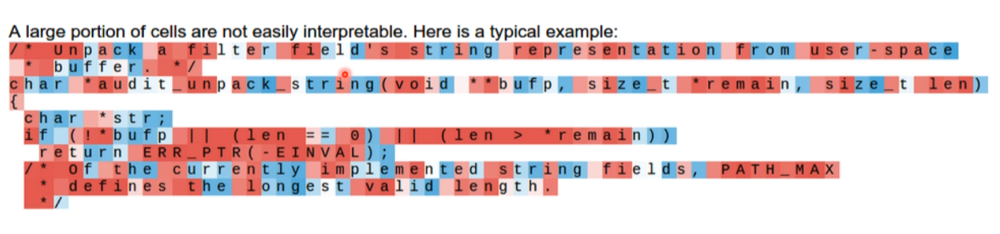
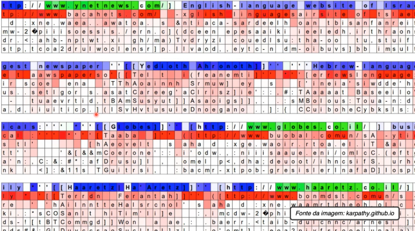

# Intuição prática - LSTM

- Artigo que explica a arquitetura das Redes Neurais Recorrentes
  [The Unreasonable Effectiveness of Recurrent Neural Networks](https://karpathy.github.io/2015/05/21/rnn-effectiveness/)

Existe um caractere especial chamado de EOS (End Of String) que indica quando
que uma frase termina. No começo da frase ele está bem azul isso significa que
a tangente hiper bolica retornou um valor 1 ou muito próximo de 1, isso quer
dizer que a frase ainda não esta acabando, quando vamos avançando o azul vai
ficando mais fraco e isso quer dizer que o valor de ativação está diminuindo,
até que ele vai chegar no final da frase até ficar com a cor mais vermelha que
indica que ele está conseguindo identificar corretamente o final da frase e esse
final é mais próximo de -1 da função de ativação.

A ideia quando se trata de código é ele descobrir o que vem depois de uma
condicional, ele usa a memória LSTM para armazenar a profundidade de uma condicional
ou laço de repetição como no caso do **for**.

Nesse tipo de rede neural é difícil interpretar o que está acontecendo dentro
desse treinamento nós não temos muito controle sobre a função de ativação nesse
cenário diferente de algoritmos como **Naive Bayes**, **Árvores de decisão** onde
conseguimos visualizar o que está acontecendo. Esse modelo é mais chamado de um
modelo de _caixa preta_.

O verde indica um neurônio que foi ativado e o azul quer dizer que ele
não foi ativado, essa cor vermelho forte quer dizer que a força da previsão
é alta (como se fosse uma probabilidade), o branco quer dizer que ele não tem
tanta certeza se aquela letra está certa (pode ser considerado um erro).

# Artigo adicional

- Visualizing and Understanding Recurrent Networks - Andrej Karpathy et al. (2015)
  [Visualizing and Understanding Recurrent Networks](https://arxiv.org/pdf/1506.02078.pdf)
